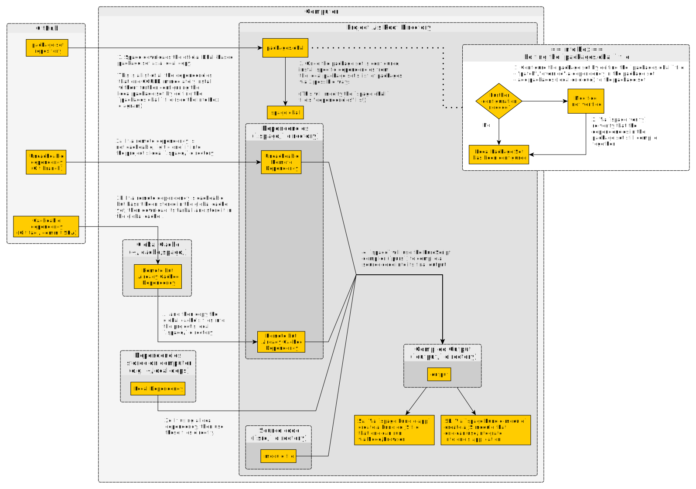

# spago

[][spago-npm]
[](https://github.com/purescript/spago/releases)
[](https://github.com/purescript/spago/actions/workflows/build.yml)
[](https://ci.appveyor.com/project/f-f/spago/branch/master)
[](http://github.com/f-f)

*(IPA: /ˈspaɡo/)*

PureScript package manager and build tool powered by [Dhall][dhall] and
[package-sets][package-sets].


## Installation

The recommended installation method for Windows, Linux and macOS is `npm` (see the latest releases on npm
  [here][spago-npm]):

```
npm install -g spago
```

Other installation methods available:
- Download the binary from the [latest GitHub release][spago-latest-release]
- Compile from source by cloning this repo and running `make install`
- With Nix, using [easy-purescript-nix][spago-nix]
- On FreeBSD, install with `pkg install hs-spago`
- On macOS, install with `brew install spago`

**General notes:**
- The assumption is that you already installed the [PureScript compiler][purescript].
  If not, get it with `npm install -g purescript`, or the recommended method for your OS.
- You might have issues with `npm` and Docker (e.g. getting the message "Downloading the spago binary failed.." etc)
  You have two options:
  - either **do not run npm as root**, because it doesn't work well with binaries. Use it as a nonprivileged user.
  - or use `--unsafe-perm`: `npm install -g --unsafe-perm spago`


## Super quick tutorial

Let's set up a new project!

```console
$ mkdir purescript-unicorns
$ cd purescript-unicorns
$ spago init
```

This last command will create a bunch of files:

```
.
├── packages.dhall
├── spago.dhall
├── src
│   └── Main.purs
└── test
    └── Main.purs
```

Let's take a look at the two [Dhall][dhall] configuration files that `spago` requires:
- `packages.dhall`: this file is meant to contain the *totality* of the packages
  available to your project (that is, any package you might want to import).

  In practice it pulls in the [official package-set][package-sets] as a base,
  and you are then able to add any package that might not be in the package set,
  or override existing ones.
- `spago.dhall`: this is your project configuration. It includes the above package set,
  the list of your dependencies, the source paths that will be used to build, and any
  other project-wide setting that `spago` will use.

To build your project, run:

```console
$ spago build
```

This will download the necessary dependencies and compile the sample project in the `output/`
directory. You can take a look at the content of `output/Main/index.js` to see what kind
of JavaScript has been generated from your new `Main.purs` file.

You can already see your project running, by doing

```console
$ spago run
```

..which is basically equivalent to the following command:

```console
$ node -e "import('./output/Main/index').then(m => m.main())"
```

..which imports the JS file you just looked at, and runs the `main` with Node.

You can also bundle the project in a single file with an entry point, so it can be run directly (useful for CLI apps):

```console
$ spago bundle-app
$ node .
```


<!-- START doctoc generated TOC please keep comment here to allow auto update -->
<!-- DON'T EDIT THIS SECTION, INSTEAD RE-RUN doctoc TO UPDATE -->

- [Design goals and reasons](#design-goals-and-reasons)
  - [Brief survey of other package managers and build tools available](#brief-survey-of-other-package-managers-and-build-tools-available)
- [Developing and contributing](#developing-and-contributing)
- [How do I...](#how-do-i)
  - [Switch from `psc-package`](#switch-from-psc-package)
  - [Switch from `bower`](#switch-from-bower)
  - [See what commands and flags are supported](#see-what-commands-and-flags-are-supported)
  - [Setup a new project using a specific package set](#setup-a-new-project-using-a-specific-package-set)
  - [Install a direct dependency](#install-a-direct-dependency)
  - [Download my dependencies locally](#download-my-dependencies-locally)
  - [Build and run my project](#build-and-run-my-project)
  - [Test my project](#test-my-project)
  - [Run a repl](#run-a-repl)
  - [Run a standalone PureScript file as a script](#run-a-standalone-purescript-file-as-a-script)
  - [List available packages](#list-available-packages)
  - [Install all the packages in the set](#install-all-the-packages-in-the-set)
  - [Override a package in the package set with a local one](#override-a-package-in-the-package-set-with-a-local-one)
  - [Override a package in the package set with a remote one](#override-a-package-in-the-package-set-with-a-remote-one)
  - [Add a package to the package set](#add-a-package-to-the-package-set)
  - [`bower link`](#bower-link)
  - [Verify that an addition/override doesn't break the package set](#verify-that-an-additionoverride-doesnt-break-the-package-set)
  - [Upgrade the package set...](#upgrade-the-package-set)
    - [...to the latest release automatically](#to-the-latest-release-automatically)
    - [...to a specific release automatically](#to-a-specific-release-automatically)
    - [...to a specific tag manually](#to-a-specific-tag-manually)
  - [Monorepo](#monorepo)
  - [`devDependencies`, `testDependencies`, or in general a situation with many configurations](#devdependencies-testdependencies-or-in-general-a-situation-with-many-configurations)
  - [Bundle a project into a single JS file](#bundle-a-project-into-a-single-js-file)
    - [1. `spago bundle-app`](#1-spago-bundle-app)
    - [2. `spago bundle-module`](#2-spago-bundle-module)
    - [Skip the "build" step](#skip-the-build-step)
  - [Make a project with PureScript + JavaScript](#make-a-project-with-purescript--javascript)
    - [Get started from scratch with Parcel (frontend projects)](#get-started-from-scratch-with-parcel-frontend-projects)
    - [Get started from scratch with Webpack (frontend projects)](#get-started-from-scratch-with-webpack-frontend-projects)
    - [Get started from scratch with Nodemon (backend and/or CLI projects)](#get-started-from-scratch-with-nodemon-backend-andor-cli-projects)
  - [Generate documentation for my project](#generate-documentation-for-my-project)
  - [Get source maps for my project](#get-source-maps-for-my-project)
  - [Use alternate backends to compile to Go, C++, Kotlin, etc](#use-alternate-backends-to-compile-to-go-c-kotlin-etc)
  - [Publish my library](#publish-my-library)
  - [Get all the licenses of my dependencies](#get-all-the-licenses-of-my-dependencies)
  - [Know which `purs` commands are run under the hood](#know-which-purs-commands-are-run-under-the-hood)
  - [Install autocompletions for `bash`](#install-autocompletions-for-bash)
  - [Install autocompletions for `zsh`](#install-autocompletions-for-zsh)
  - [Ignore or update the global cache](#ignore-or-update-the-global-cache)
  - [Know the output path for my compiled code](#know-the-output-path-for-my-compiled-code)
- [Explanations](#explanations)
  - [Visual Overview: What happens when you do 'spago build'?](#visual-overview-what-happens-when-you-do-spago-build)
  - [Configuration file format](#configuration-file-format)
  - [Why can't `spago` also install my npm dependencies?](#why-cant-spago-also-install-my-npm-dependencies)
  - [Why we don't resolve JS dependencies when bundling, and how to do it](#why-we-dont-resolve-js-dependencies-when-bundling-and-how-to-do-it)
  - [How does the "global cache" work?](#how-does-the-global-cache-work)
- [Troubleshooting](#troubleshooting)
    - [Spago is failing with some errors about "too many open files"](#spago-is-failing-with-some-errors-about-too-many-open-files)
    - [Package set caching problems](#package-set-caching-problems)
    - [I added a new package to the `packages.dhall`, but `spago` is not installing it. Why?](#i-added-a-new-package-to-the-packagesdhall-but-spago-is-not-installing-it-why)

<!-- END doctoc generated TOC please keep comment here to allow auto update -->


## Design goals and reasons

Our main design goals are:
- **Great UX**: you're not supposed to spend your life configuring the build for your project.
  A good build system just does what's most expected and gets out of the way so you can focus
  on actually writing the software.
- **Minimal dependencies**: users should not be expected to install a myriad of tools on their
  system to support various workflows. We depend only on `git` and `purs` being installed.
- **Reproducible builds**: thanks to [package sets][package-sets] and [Dhall][dhall], if your
  project builds today it will also build tomorrow and every day after that.

Some tools that inspired `spago` are: [Rust's Cargo][cargo], [Haskell's Stack][stack],
[`psc-package`][psc-package], [`pulp`][pulp] and [`purp`][purp].


### Brief survey of other package managers and build tools available

`pulp` is excellent, but it is only a build tool. This means that you'll have to use it with
either `bower` or `psc-package`:
- If you go for `bower`, you're missing out on package-sets (that is: packages versions
  that are known to be working together, saving you the headache of fitting package
  versions together all the time).
- If you use `psc-package`, you have the problem of not having the ability of overriding
  packages versions when needed, leading everyone to make their own package-set, which
  then goes unmaintained, etc.

  Of course you can use the package-set-local-setup to solve this issue, but this is
  exactly what we're doing here: integrating all the workflow in a single tool, `spago`,
  instead of having to install and use `pulp`, `psc-package`, `purp`, etc.


## Developing and contributing

We'd love your help, and welcome PRs and contributions!

Some ideas for getting started:
- [Build and run `spago`](CONTRIBUTING.md#developing-spago)
- [Help us fix bugs and build features](https://github.com/purescript/spago/issues?utf8=%E2%9C%93&q=is%3Aissue+is%3Aopen+label%3A%22help+wanted%22+label%3A%22defect%22)
- Help us improve our documentation
- Help us [log bugs and open issues][new-issue]

For more details see the [`CONTRIBUTING.md`][contributing]


## How do I...

This section contains a collection of workflows you might want to use to get things done with `spago`

### Switch from `psc-package`

Do you have an existing `psc-package` project and want to switch to `spago`?

No problem! If you run `spago init`, we'll port your existing `psc-package.json`
configuration into a new `spago.dhall` 😎

Note: `spago` won't otherwise touch your `psc-package.json` file, so you'll have to
remove it yourself.

You'll note that most of the `psc-package` commands are the same in `spago`, so porting
your existing build is just a matter of search-and-replace most of the times.


### Switch from `bower`

Switching from `bower` is about the same workflow: just run `spago init` and
we'll try to match the package versions in your `bower.json` with the ones in
the package set, porting the packages to your `spago.dhall`

Note: `spago` won't otherwise touch your `bower.json` file, so you'll have to
remove it yourself.

Some packages might not be found or have the wrong version, in which case
you'll have to carefully:
- try to run `spago install some-package` for packages in the set
- [add the missing packages](#add-a-package-to-the-package-set) if not in the set

### See what commands and flags are supported

For an overview of the available commands, run:

```console
$ spago --help
```

You will see several subcommands (e.g. `build`, `test`); you can ask for help
about them by invoking the command with `--help`, e.g.:

```console
$ spago build --help
```

This will give a detailed view of the command, and list any command-specific
(vs global) flags.

### Setup a new project using a specific package set

Since `spago init` does not necessarily use the latest package set. Fortunately, you can specify which package set to use via the `--tag` argument. See the [`purescript/package-sets` repo's releases](https://github.com/purescript/package-sets/releases) for tags you can use:

```console
$ spago init --tag "psc-0.13.8-20200822"
```


### Install a direct dependency

You can add dependencies that are available in your package set by running:

```console
# E.g. installing Halogen
$ spago install halogen

# This also supports multiple packages
$ spago install foreign simple-json
```


### Download my dependencies locally

```console
$ spago install
```

This will download all the transitive dependencies of your project (i.e. the direct dependencies,
i.e. the ones listed in the `dependencies` key of `spago.dhall`, plus all their dependencies,
recursively) to the local `.spago` folder (and the global cache, if possible).

However, running this directly is usually **not necessary**, as all commands that need the dependencies
to be installed will run this for you.

### Build and run my project

We can build the project and its dependencies by running:

```console
$ spago build
```

This is mostly just a thin layer above the PureScript compiler command `purs compile`.

*Note*: by default the `build` command will try to install any dependencies that haven't been
fetched yet - if you wish to disable this behaviour, you can pass the `--no-install` flag.

The build will produce very many JavaScript files in the `output/` folder. These
are CommonJS modules, and you can just `require()` them e.g. on Node.

It's also possible to include custom source paths when building (the ones declared in your
`sources` config are always included):

```console
$ spago build --path 'another_source/**/*.purs'

```

**Note**: the wrapper on the compiler is so thin that you can pass options to `purs`.
E.g. if you wish to output your files in some other place than `output/`, you can run

```console
$ spago build --purs-args "-o myOutput/"
```

If you wish to automatically have your project rebuilt when making changes to source files
you can use the `--watch` flag:

```console
$ spago build --watch

# or, to clear the screen on rebuild:
$ spago build --watch --clear-screen

# files ignored through git (i.e. via .gitignore) don't trigger
# rebuild by default. If you wish to override this behavior:
$ spago build --watch --allow-ignored
```

To run a command before a build you can use the `--before` flag, eg to post a notification that a build has started:

```console
$ spago build --watch --before "notify-send 'Building'"
```

To run a command after the build, use `--then` for successful builds, or `--else` for unsuccessful builds:

```console
$ spago build --watch --then "notify-send 'Built successfully'" --else "notify-send 'Build failed'"
```

Multiple commands are possible - they will be run in the order specified:

```console
$ spago build --watch --before clear --before "notify-send 'Building'"
```


If you want to run the program (akin to `pulp run`), just use `run`:
```console
# The main module defaults to "Main"
$ spago run

# Or define your own module path to Main
$ spago run --main ModulePath.To.Main

# And pass arguments through to `purs compile`
$ spago run --main ModulePath.To.Main --purs-args "--verbose-errors"

# Or pass arguments to the backend, in this case node
$ spago run --exec-args "arg1 arg2"

# For versions 18 and below, use `node-args` instead:
$ spago run --node-args "arg1 arg2"

```


### Test my project

You can also test your project with `spago`:

```console
# Test.Main is the default here, but you can override it as usual
$ spago test --main Test.Main
Build succeeded.
You should add some tests.
Tests succeeded.
```


### Run a repl

You can start a repl with the following command:

```console
$ spago repl
```


### Run a standalone PureScript file as a script

You can run a standalone PureScript file as a script via `spago script`.
Note: The module name must be `Main`, and it must export a function `main :: Effect Unit`.

By default, the following dependencies are installed: `effect`, `console`, `prelude`.

You can run a script via the following, optionally specifying a package set to use, and additional dependencies to pull from there:

```console
$ spago script --tag psc-13.8 -d node-fs path/to/script.purs
```


### List available packages

It is sometimes useful to know which packages are contained in our package set
(e.g. to see which version we're using, or to search for packages).

You can get a complete list of the packages your `packages.dhall` imports (together
with their versions and URLs) by running:

```console
$ spago ls packages
```

By using the `ls deps` command instead you can restrict the list to direct or transitive dependencies:

```console
# Direct dependencies, i.e. only the ones listed in spago.dhall
$ spago ls deps

# Transitive dependencies, i.e. all the dependencies of your dependencies
$ spago ls deps --transitive
```


### Install all the packages in the set

There might be cases where you'd like your project to depend on all the packages
that are contained in the package set (this is sometimes called
["acme build"](https://hackage.haskell.org/package/acme-everything)).

You can accomplish this in pure Dhall in your `spago.dhall`

It might look something like this (example from [here](https://github.com/purescript/spago/issues/607#issuecomment-612512906)):

```dhall
let packages = ./packages.dhall
let Package = { dependencies : List Text, repo : Text, version : Text }
let PackageAssoc = { mapKey : Text, mapValue : Package }
let getPackageName = \(v : PackageAssoc) -> v.mapKey
let List/map = https://prelude.dhall-lang.org/List/map
in
  { name = "acme"
  , dependencies =
        List/map PackageAssoc Text getPackageName (toMap packages)
  , packages = packages
  , sources = [ "src/**/*.purs" ]
  }
```


### Override a package in the package set with a local one

Let's say I'm a user of the `simple-json` package. Now, let's say I stumble upon a bug
in there, but thankfully I figure how to fix it. So I clone it locally and add my fix.

Now if I want to test this version in my current project, how can I tell `spago` to do it?

We have a `overrides` record in `packages.dhall` just for that!

In this case we override the package with its local copy, which must have a `spago.dhall`.
(it should be enough to do `spago init` to have the Bower configuration imported)

It might look like this:

```haskell
let upstream = -- <package set URL here>
in  upstream
  with simple-json = ../purescript-simple-json/spago.dhall as Location
```

Note that if we do `spago ls packages`, we'll see that it is now included as a local package:

```console
$ spago ls packages
...
signal                v10.1.0   Remote "https://github.com/bodil/purescript-signal.git"
sijidou               v0.1.0    Remote "https://github.com/justinwoo/purescript-sijidou.git"
simple-json           local     Local "./../purescript-simple-json"
simple-json-generics  v0.1.0    Remote "https://github.com/justinwoo/purescript-simple-json-generics.git"
smolder               v11.0.1   Remote "https://github.com/bodil/purescript-smolder.git"
...
```

And since local packages are just included in the build, if we add it to the `dependencies`
in `spago.dhall` and then do `spago install`, it will not be downloaded.


### Override a package in the package set with a remote one

Let's now say that we test that our fix from above works, and we are ready to Pull Request the fix.

So we push our fork and open the PR, but while we wait for the fix to land on the next
`package sets` release, we still want to use the fix in our production build.

In this case, we can just change the override to point to some commit of our fork, like this:


```haskell
let upstream = -- <package set URL here>
in  upstream
  with simple-json.repo = "https://github.com/my-user/purescript-simple-json.git"
  with simple-json.version = "701f3e44aafb1a6459281714858fadf2c4c2a977"
```

**Note**: you can use a "branch", a "tag" or a "commit hash" as a `version`.
Generally it's recommended that you avoid using branches, because if you push new
commits to a branch, `spago` won't pick them up unless you delete the `.spago` folder.


### Add a package to the package set

If a package is not in the upstream package set, you can add it in a similar way,
by changing the `additions` record in the `packages.dhall` file.

E.g. if we want to add the `facebook` package:

```haskell
let upstream = -- <package set URL here>
in  upstream
  with facebook =
    { dependencies =
        [ "console"
        , "aff"
        , "prelude"
        , "foreign"
        , "foreign-generic"
        , "errors"
        , "effect"
        ]
    , repo =
        "https://github.com/Unisay/purescript-facebook.git"
    , version =
        "v0.3.0"  -- branch, tag, or commit hash
    }
```

As you might expect, this works also in the case of adding local packages:

Example:

```haskell
let upstream = -- <package set URL here>
in  upstream
  with foobar = ../foobar/spago.dhall as Location
```


### `bower link`

See how to [add local packages](#add-a-package-to-the-package-set) or [override existing ones](#override-a-package-in-the-package-set-with-a-local-one)


### Verify that an addition/override doesn't break the package set

"But wait", you might say, "how do I know that my override doesn't break the package set?"

This is a fair question, and you can verify that your fix didn't break the rest of the
package-set by running the `verify` command.

E.g. if you patched the `foreign` package, and added it as a local package to your package-set,
you can check that you didn't break its dependents (also called "reverse dependencies")
by running:

```console
$ spago verify foreign
```

Once you check that the packages you added verify correctly, we would of course very much love
if you could pull request it to the [Upstream package-set][package-sets] ❤️

If you decide so, you can read up on how to do it [here][package-sets-contributing].


### Upgrade the package set...

The version of the package-set you depend on is fixed in the `packages.dhall` file
(look for the `upstream` var).

You can upgrade to the latest version of the package-set with the `upgrade-set`
command. It will download the package set and write
the new url and hashes in the `packages.dhall` file for you.

Spago can update the package set to the latest release or to a specific release automagically. If you wish to use a specific commit, you will have to manually edit one part of your `packages.dhall` file. Each is covered below.

#### ...to the latest release automatically

Running it would look something like this:

```console
$ spago upgrade-set
[info] Updating package-set tag to "psc-0.13.8-20200822"
Fetching the new one and generating hashes.. (this might take some time)
[info] Generating new hashes for the package set file so it will be cached.. (this might take some time)
```

#### ...to a specific release automatically

If the package set exists, running `upgrade-set` would look something like this:

```console
$ spago upgrade-set --tag "psc-0.13.8-20200822"
[info] Updating package-set tag to "psc-0.13.8-20200822"
Fetching the new one and generating hashes.. (this might take some time)
[info] Generating new hashes for the package set file so it will be cached.. (this might take some time)
```

If the package set does not exist, your `packages.dhall` file will not be touched and you will see a warning:

```console
spago upgrade-set --tag "whoops-i-made-a-big-typo"
[info] Updating package-set tag to "whoops-i-made-a-big-typo"
Fetching the new one and generating hashes.. (this might take some time)
[warn] Package-set tag "whoops-i-made-a-big-typo" in the repo "purescript/package-sets" does not exist.
Will ignore user-specified tag and continue using current tag: "psc-0.13.4-20191025"
```

#### ...to a specific tag manually

If you wish to detach from tags for your package-set, you can of course point it to a
specific commit. Just set your `upstream` to look something like this:

```haskell
let upstream =
      https://raw.githubusercontent.com/purescript/package-sets/bd72269fec59950404a380a46e293bde34b4618f/src/packages.dhall
```

### Monorepo

Spago aims to support ["monorepos"][luu-monorepo], allowing you to split a blob of code
into different "compilation units" that might have different dependencies, deliverables, etc.

A typical monorepo setup in spago consists of:
- some "libraries" (i.e. packages that other packages will depend on), each having their own `spago.dhall`
- some "apps" (i.e. packages that no one depends on), each having their own `spago.dhall`
- a single `packages.dhall` , that includes all the "libraries" as local packages, and that
  all `spago.dhall` files refer to - this is so that all packages share the same package set.

So for example if you have `lib1`, `lib2` and `app1`, you might have the following file tree:

```
.
├── app1
│   ├── spago.dhall
│   ├── src
│   │   └── Main.purs
│   └── test
│       └── Main.purs
├── lib1
│   ├── spago.dhall
│   └── src
│       └── Main.purs
├── lib2
│   ├── spago.dhall
│   └── src
│       └── Main.purs
└── packages.dhall
```

Then:
- the top level `packages.dhall` might look like this:

```dhall
let upstream = https://github.com/purescript/package-sets/releases/download/psc-0.13.4-20191025/packages.dhall sha256:f9eb600e5c2a439c3ac9543b1f36590696342baedab2d54ae0aa03c9447ce7d4
in upstream
  with lib1 = ./lib1/spago.dhall as Location
  with lib2 = ./lib2/spago.dhall as Location
```

- `lib1/spago.dhall` might look something like this:

```dhall
{ name =
    "lib1"
, dependencies =
    [ "effect"
    , "console"
    , "prelude"
    ]
, sources =
    [ "src/**/*.purs" ]
, packages =
    ../packages.dhall   -- Note: this refers to the top-level packages file
}
```

- assuming `lib2` depends on `lib1`, `lib2/spago.dhall` might look something like this:

```dhall
{ name =
    "lib2"
, dependencies =
    [ "effect"
    , "console"
    , "prelude"
    , "lib1"            -- Note the dependency here
    ]
, sources =
    [ "src/**/*.purs" ]
, packages =
    ../packages.dhall
}
```

- and then `app1/spago.dhall` might look something like this:

```hs
{ name =
    "app1"
, dependencies =
    -- Note: the app does not include all the dependencies that the lib included
    [ "prelude"
    , "simple-json" -- Note: this dep was not used by the library, only the app uses it
    , "lib2"        -- Note: we add `lib2` as dependency
    ]
, packages =
    -- We also refer to the top-level packages file here, so deps stay in sync for all packages
    ../packages.dhall
}
```


### `devDependencies`, `testDependencies`, or in general a situation with many configurations

You might have a simpler situation than a monorepo, where e.g. you just want to "split" dependencies.

A common case is when you don't want to include your test dependencies in your app's dependencies.

E.g. if you want to add `purescript-spec` to your test dependencies you can have a `test.dhall` that looks like this:
```dhall
let conf = ./spago.dhall

in conf // {
  sources = conf.sources # [ "test/**/*.purs" ],
  dependencies = conf.dependencies # [ "spec" ]
}
```

And then you can run tests like this:
```console
$ spago -x test.dhall test
```

### Bundle a project into a single JS file

For the cases when you wish to produce a single JS file from your PureScript project,
there are basically two ways to do that:

#### 1. `spago bundle-app`

This will produce a single, executable, dead-code-eliminated file:

**>= v0.15.0**

Since v0.15.0 spago uses `esbuild` as the underlying default bundler. See the [`esbuild` getting started](https://esbuild.github.io/getting-started/#install-esbuild) for installation instructions.
```console
# You can specify the main module and the target file, or these defaults will be used. This will bundle for the browser by default.
$ spago bundle-app --main Main --to index.js
Bundle succeeded and output file to index.js

# If you want to minify the build, use 
$ spago bundle-app --main Main --to index.js --minify

# Or if you want to bundle for node
$ spago bundle-app --main Main --to index.js --platform node
Bundle succeeded and output file to index.js


# We can then run it with node:
$ node .
```

**<= v0.14.0**
```console
# You can specify the main module and the target file, or these defaults will be used
$ spago bundle-app --main Main --to index.js
Bundle succeeded and output file to index.js

# We can then run it with node:
$ node .
```

#### 2. `spago bundle-module`

If you wish to produce a single, dead-code-eliminated JS module that you can `import` from
JavaScript:

**>= v0.15.0**

```console
# You can specify the main module and the target file, or these defaults will be used
$ spago bundle-module --main Main --to index.js
Bundling first...
Bundle succeeded and output file to index.js
Make module succeeded and output file to index.js

$ node -e "import('./index.js').then(m => console.log(m.main))"                              
[Function]
```

**<= v0.14.0**
```console
# You can specify the main module and the target file, or these defaults will be used
$ spago bundle-module --main Main --to index.js
Bundling first...
Bundle succeeded and output file to index.js
Make module succeeded and output file to index.js

$ node -e "console.log(require('./index').main)"
[Function]
```

#### Skip the "build" step

When running `spago bundle-app` and `spago bundle-module`, Spago will first try to `build`
your project, since bundling requires the project to be compiled first.

If you already compiled your project and want to skip this step you can pass the `--no-build` flag.


### Make a project with PureScript + JavaScript

Take a look at [TodoMVC with react-basic + spago + parcel][todomvc] for a working example,
or follow one of the next "get started" sections:

#### Get started from scratch with Parcel (frontend projects)

To start a project using Spago and Parcel together, here's the commands and file setup you'll need:

1. Follow [Spago's "Super quick tutorial"](#super-quick-tutorial)
2. Initialise a JavaScript/npm project with `npm init`
3. Install Parcel as a development-time dependency `npm i parcel --save-dev`
4. Add a JavaScript file which imports and calls the `main` function from the output of `src/Main.purs`.
  This can be placed in the root directory for your project. Traditionally this file is named `index.js`.
  The `main` function from `Main.purs` can accept arguments, this is useful since Parcel will replace
  environment variables inside of JavaScript.
  It is recommended to read any environment variables in the JavaScript file and pass them as
  arguments to `main`. Here is an example JavaScript file:

  **>= v0.15.0**
  ```js
  import * as Main from './output/Main/index';

  function main () {
      /*
      Here we could add variables such as

      var baseUrl = process.env.BASE_URL;

      Parcel will replace `process.env.BASE_URL`
      with the string contents of the BASE_URL environment
      variable at bundle/build time.
      A .env file can also be used to override shell variables
      for more information, see https://en.parceljs.org/env.html

      These variables can be supplied to the Main.main function.
      However, you will need to change the type to accept variables, by default it is an Effect.
      You will probably want to make it a function from String -> Effect ()
    */

    Main.main();
  }

  // HMR setup. For more info see: https://parceljs.org/hmr.html
  if (module.hot) {
    module.hot.accept(function () {
      console.log('Reloaded, running main again');
      main();
    });
  }

  console.log('Starting app');

  main();
  ```

  **<= v0.14.0**
  ```js
  var Main = require('./output/Main');

  function main () {
      /*
      Here we could add variables such as

      var baseUrl = process.env.BASE_URL;

      Parcel will replace `process.env.BASE_URL`
      with the string contents of the BASE_URL environment
      variable at bundle/build time.
      A .env file can also be used to override shell variables
      for more information, see https://en.parceljs.org/env.html

      These variables can be supplied to the Main.main function.
      However, you will need to change the type to accept variables, by default it is an Effect.
      You will probably want to make it a function from String -> Effect ()
    */

    Main.main();
  }

  // HMR setup. For more info see: https://parceljs.org/hmr.html
  if (module.hot) {
    module.hot.accept(function () {
      console.log('Reloaded, running main again');
      main();
    });
  }

  console.log('Starting app');

  main();
  ```

5. Add an HTML file which sources your JavaScript file. This can be named `index.html`
  and placed in the root directory of your project. Here is an example HTML file:

  ```html
  <!doctype html>
  <html lang="en" data-framework="purescript">
  <head>
    <meta http-equiv="Content-Type" content="text/html; charset=utf-8">
  </head>

  <body>
    <div id="app"></div>
    <script src="./index.js" type="module"></script>
  </body>
  </html>
  ```

6. Add a development script to `package.json` which will hot-reload the JavaScript generated
  by the compiler using Parcel. Here, we'll call this script `dev`:

  ```js
  ...
    "scripts": {
      "dev": "parcel index.html",
    },
  ...
  ```

  But in order for this script to pick up the changes we make to our PureScript files,
  we should have something that hot-recompiles our code.

  If you're using an editor integration then `purs ide` will take care of this
  recompilation transparently as you save the files.
  If not, you can run `spago build --watch` in another terminal to achieve the
  same result.

  NPM scripts allow project dependencies to be treated as if they are on your `$PATH`.
  When you run it with `npm run dev`, Parcel will tell you which port your application
  is being served on, by default this will be `localhost:1234`.

  If you've followed this guide you can navigate there in a browser and open the JavaScript console,
  you will see the output of both `index.js` and the compiled `Main.purs` file.
  When you modify any purescript file in `./src`, you should see Spago and Parcel rebuild your application,
  and the browser should execute the new code.
  For some applications you may adjust the JavaScript function that handles hot modules to
  fully reload the page with `window.location.reload();`.

7. At this point we should be able to test our program by running `npm run dev`.
  When you navigate a browser to `localhost:1234`, you should see '🍝' as output in the JavaScript console
  if this was performed successfully!

8. When you are ready to build and deploy your application as static html/js/css,
  you may add a `build` script to `package.json` in order to produce a final bundle.
  This script is usually something like `spago build && parcel build index.html`.


#### Get started from scratch with Webpack (frontend projects)

1. Follow [Spago's "Super quick tutorial"](#super-quick-tutorial)
2. Initialise a JavaScript/npm project with `npm init`
3. Add Webpack and purescript-psa as development-time dependencies: `npm install --save-dev webpack webpack-cli webpack-dev-server purescript-psa`
4. **>= v0.15.0** 

  Install the HTML plugin for WebPack `npm install --save-dev html-webpack-plugin`.

  **<= v0.14.0** 
  
  Install the PureScript loader and HTML plugin for WebPack `npm install --save-dev purs-loader html-webpack-plugin`.
  Note that you may require additional loaders for css/scss, image files, etc. Please refer to the [Webpack documentation](https://webpack.js.org/) for more information.
  
5. Create an HTML file that will serve as the entry point for your application.
  Typically this is `index.html`. In your HTML file, be sure to pull in the `bundle.js` file, which will be Webpack's output. Here is an example HTML file:

  ```html
  <!doctype html>
  <html lang="en" data-framework="purescript">
  <head>
    <meta http-equiv="Content-Type" content="text/html; charset=utf-8">
  </head>

  <body>
    <div id="app"></div>
    <script src="./bundle.js"></script>
  </body>
  </html>
  ```

6. Create a `webpack.config.js` file in the root of your project. Here is an example webpack configuration:

  **>= v0.15.0** 
  ```js
  import path from 'path'
  import HtmlWebpackPlugin from 'html-webpack-plugin'
  import webpack from 'webpack'
  import { dirname } from 'path';
  import { fileURLToPath } from 'url';

  const __dirname = dirname(fileURLToPath(import.meta.url));
  const isWebpackDevServer = process.argv.some(a => path.basename(a) === 'webpack-dev-server')
  const isWatch = process.argv.some(a => a === '--watch')

  const plugins =
    isWebpackDevServer || !isWatch ? [] : [
      function () {
        this.plugin('done', function (stats) {
          process.stderr.write(stats.toString('errors-only'))
        })
      }
    ]


  export default {
    devtool: 'eval-source-map',
    mode: 'development',
    devServer: {
      port: 4008,
      static: {
        directory: path.resolve(__dirname,'dist'),
      },
    },

    entry: './index.js',

    output: {
      path: path.resolve(__dirname,'dist'),
      filename: 'bundle.js'
    },

    module: {
      rules: [
        {
          test: /\.(png|jpg|gif)$/i,
          use: [
            {
              loader: 'url-loader',
              options: {
                limit: 8192,
              },
            },
          ],
        },
      ]
    },

    resolve: {
      modules: ['node_modules'],
      extensions: ['.js']
    },

    plugins: [
      new webpack.LoaderOptionsPlugin({
        debug: true
      }),
      new HtmlWebpackPlugin({
        title: 'purescript-webpack-example',
        template: 'index.html',
        inject: false  // See stackoverflow.com/a/38292765/3067181
      })
    ].concat(plugins)
  }
  ```

  **<= v0.14.0**
  ```js

  'use strict';

  const path = require('path');
  const HtmlWebpackPlugin = require('html-webpack-plugin');
  const webpack = require('webpack');
  const isWebpackDevServer = process.argv.some(a => path.basename(a) === 'webpack-dev-server');
  const isWatch = process.argv.some(a => a === '--watch');

  const plugins =
    isWebpackDevServer || !isWatch ? [] : [
      function(){
        this.plugin('done', function(stats){
          process.stderr.write(stats.toString('errors-only'));
        });
      }
    ]
  ;

  module.exports = {
    devtool: 'eval-source-map',

    devServer: {
      contentBase: path.resolve(__dirname, 'dist'),
      port: 4008,
      stats: 'errors-only'
    },

    entry: './src/index.js',

    output: {
      path: path.resolve(__dirname, 'dist'),
      filename: 'bundle.js'
    },

    module: {
      rules: [
        {
          test: /\.purs$/,
          use: [
            {
              loader: 'purs-loader',
              options: {
                src: [
                  'src/**/*.purs'
                ],
                spago: true,
                watch: isWebpackDevServer || isWatch,
                pscIde: true
              }
            }
          ]
        },
        {
          test: /\.(png|jpg|gif)$/i,
          use: [
            {
              loader: 'url-loader',
              options: {
                limit: 8192,
              },
            },
          ],
        },
      ]
    },

    resolve: {
      modules: [ 'node_modules' ],
      extensions: [ '.purs', '.js']
    },

    plugins: [
      new webpack.LoaderOptionsPlugin({
        debug: true
      }),
      new HtmlWebpackPlugin({
        title: 'purescript-webpack-example',
        template: 'index.html',
        inject: false  // See stackoverflow.com/a/38292765/3067181
      })
    ].concat(plugins)
  };
  ```

7. Add a `src/index.js`: this file will import and execute the PureScript `Main` module,
  and serves as the entry point for the Webpack bundler.

  You can also use this file to refer to environment variables which can then be passed to PureScript code.
  Please refer to the Webpack documentation on environment variable replacement during bundling.
  Here is an example `index.js` file:

  **>= v0.15.0**
  ```js
  import { main } from '../output/Main/index'

  main()
  console.log('app starting');
  ```

  **<= v0.14.0**
  ```js

  'use strict';

  require('./Main.purs').main();

  if (module.hot) {
    module.hot.accept();
  }

  console.log('app starting');
  ```

  Also, make sure you are calling `main` properly if you are passing arguments (due to
  PureScript specifics of [modelling effectful computations](https://stackoverflow.com/a/55750945/3067181)):

  **>= v0.15.0**

  ```js

  var arg1 = 'arg1';
  main(arg1)();

  ```

  **<= v0.14.0**
  ```js

  var arg1 = 'arg1';
  require('./Main.purs').main(arg1)();

  ```

8. Add the following development script to `package.json`:

  **>= v0.15.0**
  ```js
  ...
    "scripts": {
      ...,
      "webpack:server": "spago build -w & webpack-dev-server --progress --hot"
    },
  ...
  ```

  **<= v0.14.0**
  ```js
  ...
    "scripts": {
      ...,
      "webpack:server": "webpack-dev-server --progress --hot"
    },
  ...
  ```

9. At this point we should be able to run our program by calling `npm run webpack:server`.
  If you point your browser to `localhost:4008` you should see `🍝` in the JavaScript
  development console. This means everything went alright!

10. For production builds, it is recommended to have separate scripts to build and serve.
  Please refer to the [Webpack documentation](https://webpack.js.org/) for more information.


#### Get started from scratch with Nodemon (backend and/or CLI projects)

1. Follow [Spago's "Super quick tutorial"](#super-quick-tutorial)
2. Initialise a JavaScript/npm project with `npm init`
3. Add Nodemon as a development-time dependency: `npm install --save-dev nodemon`
4. Add a JavaScript file which imports and calls the `main` function from the output of `src/Main.purs`.

  This can be placed in the root directory of your project, and traditionally this file is named `index.js`.

  The `main` function from `Main.purs` can accept arguments, and this is useful since the Node
  runtime will replace environment variables inside of JavaScript.
  It is recommended to read any environment variables in the JavaScript file and pass them as arguments to `main`.

  Here is an example JavaScript file:
  
  **>= v0.15.0**
  ```js
  import * as Main from './output/Main';

  function main () {
      /*
      Here we could add variables such as

      var baseUrl = process.env.BASE_URL;

      Node will replace `process.env.BASE_URL`
      with the string contents of the BASE_URL environment
      variable at bundle/build time.

      These variables can be supplied to the Main.main function,
      however, you will need to change the type to accept variables, by default it is an Effect.
      You will probably want to make it a function from String -> Effect ()
    */

    Main.main();
  }
  ```

  **<= v0.14.0**
  ```js
  'use strict'

  var Main = require('./output/Main');

  function main () {
      /*
      Here we could add variables such as

      var baseUrl = process.env.BASE_URL;

      Node will replace `process.env.BASE_URL`
      with the string contents of the BASE_URL environment
      variable at bundle/build time.

      These variables can be supplied to the Main.main function,
      however, you will need to change the type to accept variables, by default it is an Effect.
      You will probably want to make it a function from String -> Effect ()
    */

    Main.main();
  }
  ```

5. At this point we should be able to run our program by calling `spago build` followed by `node index.js`.
  If you see `🍝` as output then this was successful!
6. Now we want to enable Nodemon, which will watch for file changes in the dependency tree and
  reload our Node program every time there is a new change.
  We'll also tell Spago to watch our PureScript source files so that they are compiled,
  which in turn will trigger a Nodemon reload.

  To configure this, add the following script to your `package.json` file:

  ```js
  ..
    "scripts": {
      "dev": "spago build --watch & nodemon \"node index.js\"",
    },
  ...
  ```

7. You can now run your development environment by calling `npm run dev`

8. For a production build, add the following scripts to your `package.json`:

  ```js
  ...
    "scripts": {
      "build": "spago build && node index.js"
    },
  ...
  ```

9. To run a production build, you can now run `npm run build`!

For publishing CLI programs or NPM modules, please refer to the [relevant npm documentation](https://docs.npmjs.com/cli/publish).

Please note that if you are publishing a Node module for consumption by JavaScript users,
it is recommended that you pre-compile your PureScript project before distributing it.


### Generate documentation for my project

To build documentation for your project and its dependencies (i.e. a "project-local
[Pursuit][pursuit]"), you can use the `docs` command:
```console
$ spago docs
```

This will generate all the documentation in the `./generated-docs` folder of your project.
You might then want to open the `index.html` file in there.

If you wish for the documentation to be opened in browser when generated, you can pass an `open` flag:
```console
$ spago docs --open
```

To build the documentation as Markdown instead of HTML, or to generate tags for your project,
you can pass a `format` flag:
```console
$ spago docs --format ctags
```

### Get source maps for my project

Quoting from [this tweet](https://twitter.com/jusrin00/status/1092071407356387328):

1. build with `--purs-args "-g sourcemaps"`
2. source output (like `var someModule = require('./output/Whatever/index.js');`) and use
   something like `parcel`, to avoid mangling/destroying the sourcemaps
3. now you can see your breakpoints in action

**Note**: In >= v0.15.0 this needs to be `import * as someModule from './output/Whatever/index.js'`

### Use alternate backends to compile to Go, C++, Kotlin, etc

Spago supports compiling with alternate purescript backends like [psgo] or [pskt].
To use an alternate backend, add the `backend` option to your `spago.dhall` file:

```dhall
{ name = "aaa"
, backend = "psgo"
...
```

The value of the `backend` entry should be the name of the backend executable.

### Publish my library


If you wish to develop a library with `spago` you can definitely do so, and use it to
manage and build your project, until you need to "publish" your library, where you'll need
to use `pulp`.

Before you start you need to have instaled pulp and bower, both of these can be installed using npm

You also need to add some keys to your `spago.dhall` file:
  * The first one is `license` it need to be a valid [SPDX license](https://spdx.org/licenses/). 
  * You also need to add a `repository` key that references the location of the project repository
here is a example
``` dhall
{ name = "my-first-package"
, dependencies =
  [ "console", "prelude", "psci-support" ]
, packages = ./packages.dhall
, sources = [ "src/**/*.purs", "test/**/*.purs" ]
, license = "MIT"
, repository = "https://github.com/me/purescript-my-first-project"
}
```

This will generate a correct `bower.json` file which will be used by `pulp` later.


When you decide you want to publish your library for others to use, you should:
- run `spago bump-version --no-dry-run <BUMP>`. This will generate a `bower.json` in a new  commit in Git that is tagged with the version.
- run `pulp login`. This will ensure that you are logged in befor you try to publish a package
- run `pulp publish`. This will ensure the package is registered in Bower, push the version tag to Git and upload documentation to Pursuit.
- create a PR to add your package to https://github.com/purescript/registry/blob/master/new-packages.json

The PureScript ecosystem uses the Bower registry as a "unique names registry".
So in order to "publish" a package one needs to add it there, and eventually to [`package-sets`][package-sets].
Consequentially, package-sets requires (full instructions [here][package-sets-contributing])
that packages in it:
- are in the Bower registry
- use `spago bump-version` or `pulp version` (because this gives versions with `vX.Y.Z`)
- use `pulp publish` (so it's available on the Bower registry and on [Pursuit][pursuit])

All of this will be automated in future versions, removing the need for Pulp.

A library published in this way is [purescript-rave](https://github.com/reactormonk/purescript-rave).


### Get all the licenses of my dependencies

For compliance reasons, you might need to fetch all the `LICENSE` files of your dependencies.

To do this you can exploit the `ls deps` command.

E.g. if you want to print out all the `LICENSE` files of your direct dependencies:

```bash
#!/usr/bin/env bash

# Note: the `awk` part is to cut out only the package name
for dep in $(spago ls deps | awk '{print $1}')
do
  cat $(find ".spago/${dep}" -iname 'LICENSE')
done
```

### Know which `purs` commands are run under the hood

The `-v` flag will print out all the `purs` commands that `spago` invokes during its operations,
plus a lot of diagnostic info, so you might want to use it to troubleshoot weird behaviours
and/or crashes.


### Install autocompletions for `bash`

You can just add this to your `.bashrc`:

```bash
source <(spago --bash-completion-script `which spago`)
```

or alternatively if you don't want to edit your `~/.bashrc`:

```bash
spago --bash-completion-script $(which spago) >> ~/.bash_completion
```

### Install autocompletions for `zsh`

Autocompletions for `zsh` need to be somewhere in the `fpath` - you can see the folders
included in your by running `echo $fpath`.

You can also make a new folder - e.g. `~/.my-completions` - and add it to the `fpath`
by just adding this to your `~/.zshrc`:

```bash
fpath=(~/.my-completions $fpath)
```

Then you can obtain the completion definition for zsh and put it in a file called
`_spago` [(yes it needs to be called like that)](https://github.com/zsh-users/zsh-completions/blob/master/zsh-completions-howto.org#telling-zsh-which-function-to-use-for-completing-a-command):

```bash
spago --zsh-completion-script $(which spago) > ~/.my-completions/_spago
```

Then, reload completions with:

```bash
compinit
```

*Note*: you might need to call this multiple times for it to work.


### Ignore or update the global cache

There is a global cache that `spago` uses to avoid re-downloading things - its
location will be printed if you call e.g. `spago install -v`.

It's possible to change the behaviour of the global cache with the `--global-cache` flag
that is accepted by many commands. You can either:
- skip the cache with `--global-cache=skip`: in this case the global cache will be ignored
  and the local project will re-download everything
- update the cache to the latest version with `--global-cache=update`: this might be useful
  if you want to globally cache a tag or commit that is newer than 24h - the time `spago` will
  wait before updating its metadata file about "which things are globally cacheable".

### Know the output path for my compiled code

As there are now various factors that can affect the output path of compiled code, run
`spago path output` along with any flags you would pass to `spago build` (like
`--purs-args`) to return the output path Spago is using.
This can be useful for sharing an output folder with `webpack`, for instance.

## Explanations

### Visual Overview: What happens when you do 'spago build'?



### Configuration file format

It's indeed useful to know what's the format (or more precisely, the [Dhall][dhall]
type) of the files that `spago` expects. Let's define them in Dhall:

```haskell
-- The basic building block is a Package:
let Package =
  { dependencies : List Text  -- the list of dependencies of the Package
  , repo = Text               -- the address of the git repo the Package is at
  , version = Text            -- git tag, branch, or commit hash
  }

-- The type of `packages.dhall` is a Record from a PackageName to a Package
-- We're kind of stretching Dhall syntax here when defining this, but let's
-- say that its type is something like this:
let PackageSet =
  { console : Package
  , effect : Package
  ...                  -- and so on, for all the packages in the package-set
  }

-- The type of the `spago.dhall` configuration is then the following:
let Config =
  { name : Text                   -- the name of our project
  , dependencies : List Text      -- the list of dependencies of our app
  , backend : Maybe Text          -- Nothing by default, meaning use purs. If specified, spago will use the executable as the backend
  , sources : List Text           -- the list of globs for the paths to always include in the build
  , packages : PackageSet         -- this is the type we just defined above
  }
```

### Why can't `spago` also install my npm dependencies?

A common scenario is that you'd like to use things like `react-basic`, or want to depend
on JS libraries like ThreeJS.
In any case, you end up depending on some NPM package.

And it would be really nice if `spago` would take care of installing all of these
dependencies, so we don't have to worry about running npm besides it, right?

While these scenarios are common, they are also really hard to support.
In fact, it might be that a certain NPM package in your transitive dependencies
would only support the browser, or only node. Should `spago` warn about that?
And if yes, where should we get all of this info?

Another big problem is that the JS backend is not the only backend around. For example,
PureScript has a [C backend][purec] and an [Erlang backend][purerl] among the others.

These backends are going to use different package managers for their native dependencies,
and while it's feasible for `spago` to support the backends themselves, also supporting
all the possible native package managers (and doing things like building package-sets for their
dependencies' versions) is not a scalable approach (though we might do this in the future if
there's enough demand).

So this is the reason why if you or one of your dependencies need to depend on some "native"
packages, you should run the appropriate package-manager for that (e.g. npm).

For examples on how to do it, see next section.


### Why we don't resolve JS dependencies when bundling, and how to do it

`spago` only takes care of PureScript land. In particular, `bundle-module` will do the
most we can do on the PureScript side of things (dead code elimination), but will
leave the `require`s still in.

To fill them in you should use the proper js tool of the day, at the time of
writing [ParcelJS][parcel] looks like a good option.

If you wish to see an example of a project building with `spago` + `parcel`, a simple
starting point is the [TodoMVC app with `react-basic`][todomvc].
You can see in its `package.json` that a "production build" is just
`spago build && parcel build index.html`.

If you open its `index.js` you'll see that it does a `require('./output/Todo.App')`:
the files in `output` are generated by `spago build`, and then the `parcel` build resolves
all the `require`s and bundles all these js files in.

Though this is not the only way to include the built js - for a slimmer build or for importing
some PureScript component in another js build we might want to use the output of `bundle-module`.

For an example of this in a "production setting" you can take a look at [affresco][affresco].
It is a PureScript monorepo of React-based components and apps.

The gist of it is that the PureScript apps in the repo are built with `spago build`
(look in the `package.json` for it), but all the React components can be imported from
JS apps as well, given that proper modules are built out of the PS sources.

This is where `spago bundle-module` is used: the `build-purs.rb` builds a bundle out of every
single React component in each component's folder - e.g. let's say we `bundle-module` from
the `ksf-login` component and output it in the `index.js` of the component's folder; we can
then `yarn install` the single component (note it contains a `package.json`), and require it
as a separate npm package with `require('@affresco/ksf-login')`.

### How does the "global cache" work?

Every time `spago` will need to "install dependencies" it will:
- check if the package is local to the filesystem: if it is then it will skip it as we can just
  point to the files
- check if the ref is already in the global cache. If it is, it will just copy it
  to the project-local cache
- download [a metadata file from the `package-sets-metadata`][package-sets-metadata-file] repo
  if missing from the global cache or older than 24 hours.

  This file contains the list of *tags* and *commits* for every package currently in the package
  set, updated hourly.
- check if the tag or commit of the package we need to download is in this cached index,
  and if it is then this means we can "globally cache" that version - this is because commit
  hashes are immutable, and tags are "immutable enough"
- if a version is deemed to be "globally cacheable" then a tarball of that ref is downloaded
  from GitHub and copied to both the global and the local cache
- otherwise, the repo is just cloned to the local cache

Note: a question that might come up while reading the above might be "why not just hit GitHub
to check commits and tags for every repo while installing?"

The problem is that GitHub limits token-less API requests to 50 per hour, so any
decently-sized installation will fail to get all the "cacheable" items, making the
global cache kind of useless. So we are just caching all of that info for everyone here.


## Troubleshooting

#### Spago is failing with some errors about "too many open files"

This might happen because the limit of "open files per process" is too low in your OS - as
`spago` will try to fetch all dependencies in parallel, and this requires lots of file operations.

You can limit the number of concurrent operations with the `-j` flag, e.g.:

```
$ spago -j 10 install
```

To get a ballpark value for the `j` flag you can take the result of the `ulimit -n` command
(which gives you the current limit), and divide it by four.


#### Package set caching problems

If you encounter any issues with the hashes for the package-set (e.g. the hash is not deemed
correct by `spago`), then you can have the hashes recomputed by running the `freeze` command:

```console
$ spago freeze
```

However, this is a pretty rare situation and in principle it should not happen, and when
it happens it might not be secure to run the above command.

To understand all the implications of this I'd invite you to read about
[the safety guarantees][dhall-hash-safety] that Dhall offers.


#### I added a new package to the `packages.dhall`, but `spago` is not installing it. Why?

Adding a package to the package-set just includes it in the set of possible packages you
can depend on. However, if you wish `spago` to install it you should then add it to
the `dependencies` list in your `spago.dhall`.


[psgo]: https://github.com/andyarvanitis/purescript-native
[pskt]: https://github.com/csicar/pskt
[pulp]: https://github.com/purescript-contrib/pulp
[purp]: https://github.com/justinwoo/purp
[dhall]: https://github.com/dhall-lang/dhall-lang
[cargo]: https://github.com/rust-lang/cargo
[stack]: https://github.com/commercialhaskell/stack
[purec]: https://github.com/pure-c/purec
[parcel]: https://parceljs.org
[purerl]: https://github.com/purerl/purescript
[pursuit]: https://pursuit.purescript.org/
[todomvc]: https://github.com/f-f/purescript-react-basic-todomvc
[affresco]: https://github.com/KSF-Media/affresco/tree/4b430b48059701a544dfb65b2ade07ef9f36328a
[spago-npm]: https://www.npmjs.com/package/spago
[new-issue]: https://github.com/purescript/spago/issues/new
[spago-nix]: https://github.com/justinwoo/easy-purescript-nix/blob/master/spago.nix
[purescript]: https://github.com/purescript/purescript
[psc-package]: https://github.com/purescript/psc-package
[contributing]: CONTRIBUTING.md
[luu-monorepo]: https://danluu.com/monorepo/
[package-sets]: https://github.com/purescript/package-sets
[travis-spago]: https://travis-ci.com/purescript/spago
[spago-issues]: https://github.com/purescript/spago/issues
[spacchettibotti]: https://github.com/spacchettibotti
[dhall-hash-safety]: https://github.com/dhall-lang/dhall-lang/wiki/Safety-guarantees#code-injection
[windows-issue-yarn]: https://github.com/purescript/spago/issues/187
[spago-latest-release]: https://github.com/purescript/spago/releases/latest
[ubuntu-issue-netbase]: https://github.com/purescript/spago/issues/196
[ubuntu-issue-libtinfo]: https://github.com/purescript/spago/issues/104#issue-408423391
[package-sets-metadata]: https://github.com/spacchetti/package-sets-metadata
[package-sets-contributing]: https://github.com/purescript/package-sets/blob/master/CONTRIBUTING.md
[package-sets-metadata-file]: https://github.com/spacchetti/package-sets-metadata/blob/master/metadataV1.json
