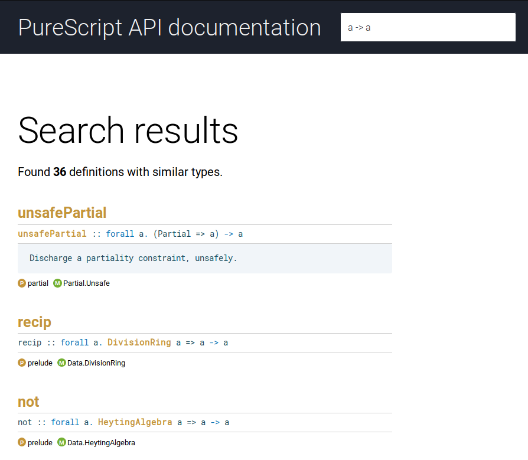

# purescript-docs-search

[](https://travis-ci.org/spacchetti/purescript-docs-search)

An app that adds search capabilities to generated documentation for purescript code.

It supports nearly-all functionality of [Pursuit](https://github.com/purescript/pursuit), including querying by type.

## Installing

When using [spago](https://github.com/spacchetti/spago), you don't need to install this app manually: run `spago docs` or `spago search`.

Otherwise, use [npx](https://github.com/npm/npx): `npx purescript-docs-search`.

## Usage

There are two usage scenarios:

### Patching static documentation

Use `purescript-docs-search build-index` command to patch HTML files located in `generated-docs/html`. You then will be able to search for declarations or types:



The user interface of the app is optimised for keyboard-only use.

**S** hotkey can be used to focus on the search field, **Escape** can be used to leave it. Pressing **Escape** twice will close the search results listing.

### Using the CLI

Running `purescript-docs-search` within a project directory will open an interactive command-line session.

Note that unlike in Pursuit, most relevant results will appear last.

A quick demo:

[](https://asciinema.org/a/Hexie5JoWjlAqLqv2IgafIdb9)

You may notice that the CLI offers slightly better results than the web interface. This is a performance tradeoff.

## Development

```
npm install
npm run build # or build-dev to skip JS compression stage
```

Use `spago docs --no-search && ./dist/purescript-docs-search build-index` to generate the docs and patch them using the local version of the app.
